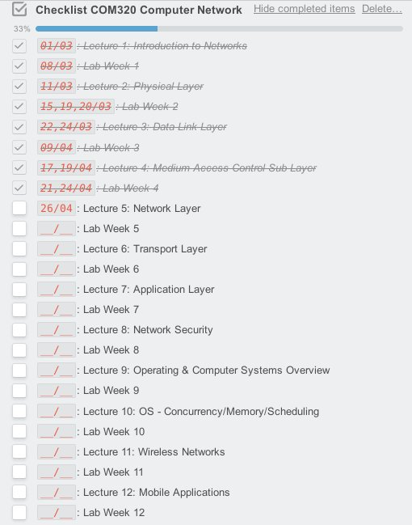

## Team Network-System

> Số lượng thành viên: **03**
>
> Team leader: **Van-Toan Ha ([@h4rdw0rk](https://github.com/h4rdw0rk))**

### Các Task trong tháng 04/2017

**1. Lê Tú Trinh ([@TrinhTu](https://github.com/TrinhTu))**

- Task27 - Javascript Course 01 Part 04 (03 Days)
- Task28 - Minification and Obfuscation
- Task29 - Linux Course 01 (10 Days)

**2. Nguyễn Công Trứ ([@hellsins](https://github.com/hellsins))**

- Task38 - CentOS6 LAMP With Virtualhost (2 Days)
- Side Project EndPoint Security - Lab Active Directory

**3. Nguyễn Tấn Phát ([@romnguyen10](https://github.com/romnguyen10))**

- 09/04-26/04: Task03 - COM320 Computer Network (Continue)
- Tiến độ:

---
