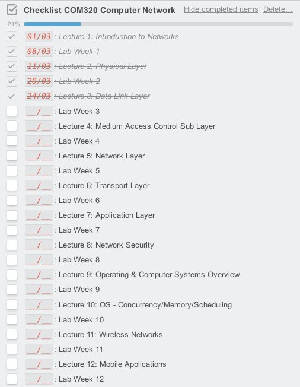

## Team Network-System

> Số lượng thành viên: **03. ([@thanhnhut](https://github/thanhnhut) đã out)**
>
> Team leader: **Van-Toan Ha ([@h4rdw0rk](https://github/h4rdw0rk))**

### Các Task trong tháng 03/2017

**1. Lê Tú Trinh ([@TrinhTu](https://github/TrinhTu))**

- Task20 - User-agent and Cookie
- Task23 - CTF HackThis (Score: 2810 pts - Continue)
- Task24 - Data Tampering
- Task25 - Javascript Course 01 Part 03 (Day 01-04 Complete)
- Task26 - Nmap Port Scanning (Day 01-03 Complete)

**2. Nguyễn Công Trứ ([@hellsins](https://github/hellsins))**

- Task34 - Translation TCP-IP Illustrated Vol1 Page 558to565
- Task35 - Translation TCP-IP Illustrated Vol1 Page 565to573 (Day 01-02 Complete)
- Task12 - GRUB Linux (Continue)
- Task36 - CentOS6 LAMP And PhpBB
- Task37 - CSS3 Course (Day 01-03 Complete)

**3. Nguyễn Tấn Phát ([@romnguyen10](https://github/romnguyen10))**

- 24/02-24/03: Task03 - COM320 Computer Network (Continue)
- Tiến độ:

---
